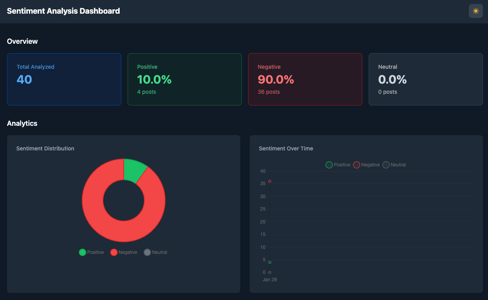
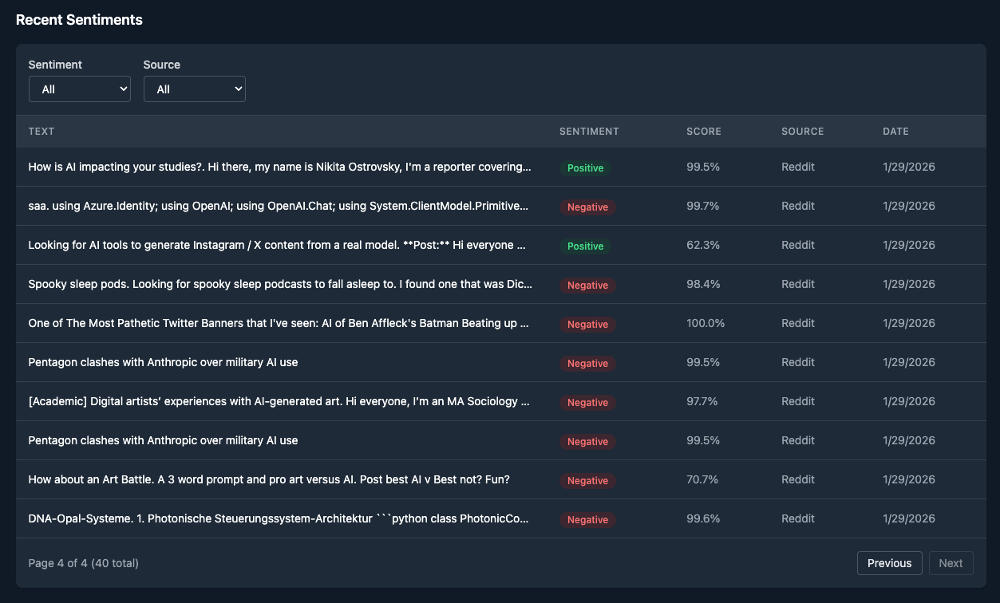

# AI Sentiment Analysis Demo

Real-time sentiment analysis application using NLP/ML. Fetches social media data, analyzes sentiment with Hugging Face Transformers, and displays results in an interactive dashboard.




## Tech Stack

- **Backend:** Python 3.9+, FastAPI, Motor (async MongoDB)
- **Frontend:** React 19, Vite, TypeScript, Tailwind CSS, Chart.js
- **ML/NLP:** Hugging Face Transformers (DistilBERT)
- **Database:** MongoDB Atlas
- **Hosting:** Render (API), Vercel (Frontend), GitHub Actions (Worker)

## Project Structure

```
/backend                    # FastAPI REST API
  /app
    /database               # MongoDB connection (Motor async)
    /models                 # Pydantic models (sentiment, stats, errors)
    /routes                 # API endpoints (sentiments, stats)
    /services               # Business logic layer
    /exceptions             # Custom exception handlers
  main.py                   # FastAPI application entry point

/frontend                   # React Dashboard
  /src
    /components
      /layout               # Header, DashboardLayout
      /cards                # StatCard, StatsGrid
      /charts               # SentimentPie, TimelineChart
      /table                # SentimentsTable, Filters, Pagination
      /common               # LoadingSpinner, EmptyState
    /hooks                  # useSentiments, useStats, useDarkMode
    /services               # API client
    /types                  # TypeScript interfaces
    /pages                  # Dashboard page

/worker                     # Sentiment analysis worker
  /analyzer                 # HuggingFace sentiment analysis
  /fetcher                  # Twitter and Reddit data fetchers
  /storage                  # API client for saving results
  /pipeline                 # Orchestrator for fetch → analyze → store
  main.py                   # CLI entry point

/.github/workflows          # GitHub Actions
  worker.yml                # Scheduled worker (every 15 min)
```

## Quick Start

### Prerequisites

- Python 3.9+
- Node.js 20+
- npm 10+
- MongoDB Atlas account

### Setup

1. **Clone and install all dependencies:**

```bash
git clone <repo-url>
cd ai-sentiment-analysis-demo
npm run setup
```

This creates virtual environments (`venv/`) in both `backend/` and `worker/` directories and installs all dependencies.

2. **Configure environment variables:**

```bash
cp backend/.env.example backend/.env
cp frontend/.env.example frontend/.env
cp worker/.env.example worker/.env
```

Edit each `.env` file with your credentials (see Environment Variables section below).

3. **Run all services:**

```bash
npm run dev
```

- Backend API: http://localhost:8000
- Frontend Dashboard: http://localhost:5173

### Manual Setup (Alternative)

If you prefer to set up environments manually:

```bash
# Backend
cd backend
python3 -m venv venv
./venv/bin/pip install -r requirements.txt

# Worker
cd ../worker
python3 -m venv venv
./venv/bin/pip install -r requirements.txt

# Frontend
cd ../frontend
npm install
```

## Available Commands

Run from the root directory:

| Command | Description |
|---------|-------------|
| `npm run dev` | Run all apps with Turborepo UI (sidebar) |
| `npm run dev:stream` | Run all apps with colored log prefixes |
| `npm run backend` | Run backend only |
| `npm run frontend` | Run frontend only |
| `npm run worker` | Run worker only (dry-run mode) |
| `npm run build` | Build all packages |
| `npm run lint` | Lint all packages |
| `npm run setup` | Install all dependencies (npm + Python) |

### Worker CLI

Run the worker directly for manual data ingestion:

```bash
# From project root (uses venv automatically)
npm run worker

# Or run directly with venv
cd worker
./venv/bin/python -m worker.main --keyword "AI" --limit 50 --dry-run

# From project root with module syntax
./worker/venv/bin/python -m worker.main --keyword "technology" --limit 100

# With verbose logging
./worker/venv/bin/python -m worker.main --keyword "AI" -v
```

| Flag | Description | Default |
|------|-------------|---------|
| `-k, --keyword` | Search keyword | `AI` |
| `-l, --limit` | Max posts per source | `100` |
| `--dry-run` | Skip saving to API | `false` |
| `-v, --verbose` | Debug logging | `false` |

## Environment Variables

Create a `.env` file in each directory based on `.env.example`:

### backend/.env

| Variable | Description |
|----------|-------------|
| `MONGODB_URI` | MongoDB Atlas connection string |

### frontend/.env

| Variable | Description |
|----------|-------------|
| `VITE_API_URL` | Backend API URL (default: http://localhost:8000/api/v1) |

### worker/.env

| Variable | Description |
|----------|-------------|
| `MONGODB_URI` | MongoDB Atlas connection string |
| `TWITTER_BEARER_TOKEN` | Twitter/X API bearer token (optional) |
| `HUGGINGFACE_API_KEY` | Hugging Face API key (optional) |
| `API_BASE_URL` | Backend API URL (default: http://localhost:8000) |
| `DEFAULT_KEYWORD` | Default search keyword (default: AI) |
| `DEFAULT_LIMIT` | Default posts limit (default: 100) |

## API Keys Setup

### MongoDB Atlas

1. Create a free account at [mongodb.com/atlas](https://www.mongodb.com/atlas)
2. Create a new cluster (free tier available)
3. Go to **Database Access** → Add a database user with password
4. Go to **Network Access** → Add IP `0.0.0.0/0` (allow all) or your specific IP
5. Go to **Database** → Click **Connect** → **Drivers** → Copy the connection string
6. Replace `<password>` with your database user password

```
mongodb+srv://username:<password>@cluster0.xxxxx.mongodb.net/?retryWrites=true&w=majority
```

### Twitter/X API (Optional)

1. Apply for a developer account at [developer.x.com](https://developer.x.com)
2. Create a new project and app
3. Go to **Keys and Tokens** → Generate **Bearer Token**
4. Copy the bearer token (starts with `AAAA...`)

> Note: Twitter API requires approval and may have rate limits. Reddit is used as a fallback.

### Hugging Face API (Optional)

1. Create a free account at [huggingface.co](https://huggingface.co)
2. Go to **Settings** → **Access Tokens** ([huggingface.co/settings/tokens](https://huggingface.co/settings/tokens))
3. Click **New token** → Name it → Select **Read** access
4. Copy the token (starts with `hf_...`)

> Note: Only needed for private models. Public models work without authentication.

## API Endpoints

### Health

| Method | Endpoint | Description |
|--------|----------|-------------|
| GET | `/health` | Root health check |
| GET | `/api/v1/health` | API v1 health check with version info |

### Sentiments

| Method | Endpoint | Description |
|--------|----------|-------------|
| GET | `/api/v1/sentiments` | List sentiments (paginated) |
| GET | `/api/v1/sentiments/{id}` | Get single sentiment by ID |
| POST | `/api/v1/sentiments` | Create single sentiment |
| POST | `/api/v1/sentiments/batch` | Create multiple sentiments (with deduplication) |

**Query Parameters for `GET /api/v1/sentiments`:**

| Parameter | Type | Description |
|-----------|------|-------------|
| `page` | int | Page number (default: 1) |
| `limit` | int | Items per page (default: 20, max: 100) |
| `sentiment` | string | Filter by sentiment: `positive`, `negative`, `neutral` |
| `source` | string | Filter by source (e.g., `twitter`, `reddit`) |
| `date_from` | datetime | Filter records from this date (ISO 8601) |
| `date_to` | datetime | Filter records until this date (ISO 8601) |

**Request Body for `POST /api/v1/sentiments`:**

```json
{
  "text": "I love this product!",
  "sentiment": "positive",
  "score": 0.95,
  "source": "twitter",
  "source_id": "1234567890"
}
```

**Request Body for `POST /api/v1/sentiments/batch`:**

```json
{
  "records": [
    { "text": "Great!", "sentiment": "positive", "score": 0.9, "source": "twitter", "source_id": "123" },
    { "text": "Terrible", "sentiment": "negative", "score": 0.85, "source": "reddit", "source_id": "456" }
  ]
}
```

**Batch Response:**

```json
{
  "data": {
    "created_count": 2,
    "skipped_count": 0
  }
}
```

### Statistics

| Method | Endpoint | Description |
|--------|----------|-------------|
| GET | `/api/v1/stats/summary` | Aggregated sentiment statistics |
| GET | `/api/v1/stats/timeline` | Time series data for charts |

**Query Parameters for `GET /api/v1/stats/timeline`:**

| Parameter | Type | Description |
|-----------|------|-------------|
| `date_from` | datetime | Start date filter (ISO 8601) |
| `date_to` | datetime | End date filter (ISO 8601) |
| `granularity` | string | Time bucket: `hour`, `day`, `week`, `month` (default: `day`) |

### Response Formats

**Paginated Response:**
```json
{
  "data": [...],
  "meta": {
    "page": 1,
    "limit": 20,
    "total": 100,
    "total_pages": 5
  }
}
```

**Single Item Response:**
```json
{
  "data": { ... }
}
```

**Error Response:**
```json
{
  "error": {
    "code": "NOT_FOUND",
    "message": "Sentiment with id 'abc123' not found",
    "details": []
  }
}
```

### API Documentation

Interactive API documentation is available when the backend is running:

- **Swagger UI:** http://localhost:8000/docs
- **ReDoc:** http://localhost:8000/redoc
- **OpenAPI JSON:** http://localhost:8000/openapi.json

## Dashboard Features

The frontend dashboard includes:

- **Stats Overview:** 4 metric cards showing total analyzed, positive %, negative %, neutral %
- **Sentiment Distribution:** Doughnut chart visualizing sentiment breakdown
- **Timeline Trends:** Line chart showing sentiment over time
- **Sentiments Table:** Paginated list with filters by sentiment and source
- **Dark Mode:** Toggle with localStorage persistence, respects system preference
- **Responsive Design:** Mobile-friendly layout

## GitHub Actions

The worker runs automatically via GitHub Actions:

- **Schedule:** Every 15 minutes
- **Manual Trigger:** Workflow dispatch with custom keyword/limit

### Required Secrets

Configure these in your repository settings (Settings → Secrets → Actions):

| Secret | Description |
|--------|-------------|
| `MONGODB_URI` | MongoDB Atlas connection string |
| `TWITTER_BEARER_TOKEN` | Twitter API bearer token |
| `API_BASE_URL` | Deployed backend URL |

## License

MIT
