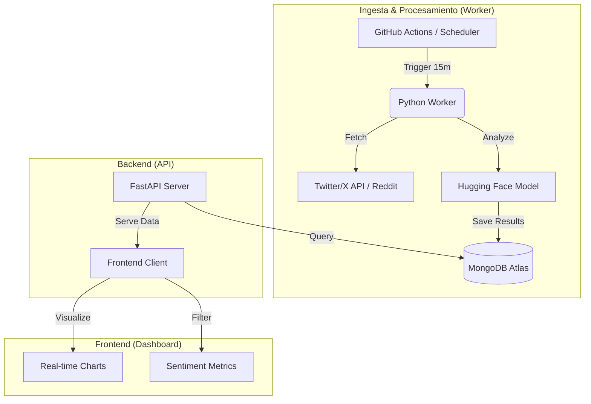

# AI Sentiment Analysis Assistant


Una aplicación fullstack que monitorea menciones en redes sociales en tiempo real, las procesa con modelos de NLP para determinar el sentimiento (positivo, negativo, neutro) y visualiza los resultados en un dashboard interactivo. Diseñada para operar con una arquitectura **Serverless de Coste $0**.

## 🏗 Arquitectura

El sistema está desacoplado en tres componentes principales para asegurar escalabilidad y modularidad.



## 🚀 Tech Stack

### Backend & AI
*   **Lenguaje:** Python 3.12
*   **Framework API:** FastAPI
*   **NLP/ML:** Hugging Face `transformers` (DistilBERT), Scikit-learn, Pandas.
*   **Base de Datos:** MongoDB Atlas (NoSQL).

### Frontend
*   **Framework:** React 19 + Vite.
*   **Estilos:** Tailwind CSS.
*   **Visualización:** Chart.js / Recharts.

### Infraestructura (Coste $0 Strategy)
*   **API Hosting:** Render (Web Service gratuito).
*   **Worker:** GitHub Actions (Cron Workflows) o Render Background Worker.
*   **Frontend Hosting:** Vercel.

## ✨ Características

*   **Ingesta de Datos:** Captura de posts/tweets basados en palabras clave.
*   **Análisis de Sentimiento:** Clasificación automática usando LLMs ligeros.
*   **Dashboard Interactivo:** Nubes de palabras, tendencias temporales y distribución de polaridad.
*   **API RESTful:** Endpoints rápidos y documentados (Swagger UI).

## 📦 Instalación y Uso Local

### Prerrequisitos
*   Node.js 20+
*   Python 3.12+
*   MongoDB Atlas URI

### 1. Clonar el repositorio
```bash
git clone https://github.com/tu-usuario/ai-sentiment-analysis-demo.git
cd ai-sentiment-analysis-demo
```

### 2. Backend (API)
```bash
cd backend
python -m venv venv
source venv/bin/activate  # o .\venv\Scripts\activate en Windows
pip install -r requirements.txt
uvicorn main:app --reload
```

### 3. Frontend
```bash
cd frontend
npm install
npm run dev
```

## 🛠 Despliegue

### Backend (Render)
1. Conectar repositorio a Render.
2. Configurar Build Command: `pip install -r requirements.txt`.
3. Configurar Start Command: `uvicorn main:app --host 0.0.0.0 --port $PORT`.

### Frontend (Vercel)
1. Importar proyecto en Vercel.
2. Framework Preset: Vite.

## 📄 Licencia
Distribuido bajo la licencia MIT.
